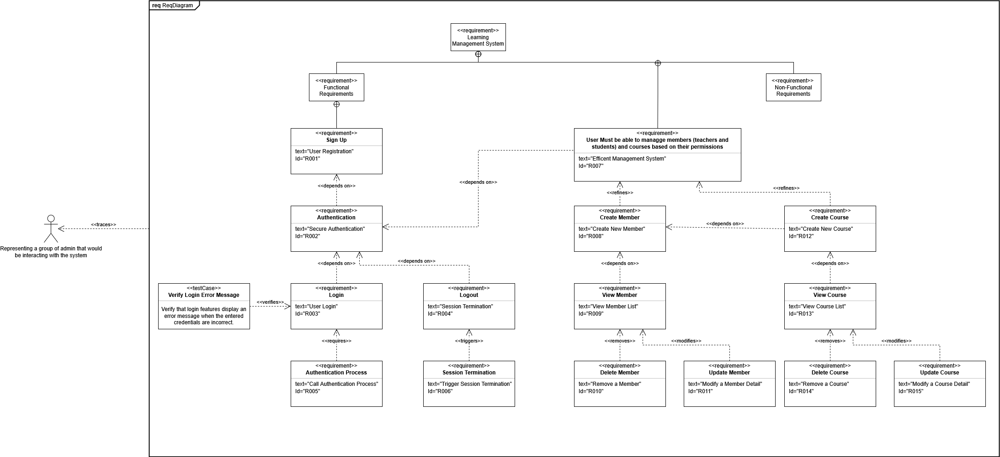

# **Assignment: Full-Stack CRUD Application Development with DevOps Practices**
## **Information**

* **Student ID:** n12136069
* **Student Name:** Thanh Tu Le
* **Project:** Learning Management System
* **JIRA Board:** [Link](https://lttcyborg.atlassian.net/jira/software/projects/ALMS/boards/5)
* **Requirement Diagram:**

* **Public Address:** [Link](http://3.27.76.157)

## **Project Setup**

### **Cloning the Repository**
Run the following code
```
git clone https://github.com/Altterisk/A1---Learning-Management-System.git
cd A1---Learning-Management-System
```
### **Backend Setup**
Setup MongooseDB and create a .env file inside the backend folder (for local testing)
```
MONGO_URI=<YOUR_MONGOOSE_URI>
JWT_SECRET=<YOUR_JWT_SECRET>
PORT=5001
```
Start the Backend
```
cd backend
npm install
npm run start
```
### **Frontend Setup**
Start the Frontend
```
cd frontend
npm install
npm run start
```
## **CI/CD Pipeline**
This project uses GitHub Actions for CI/CD automation, deploying with AWS LC2.
### **Trigger Condition**
The CI/CD pipeline runs automatically when code is pushed to the main branch.
### **Workflow File**
Workflow File: [Link](.github/workflows/ci.yml)
### **Workflow Steps**
* Clones the repository into the runner
```
- name: Checkout Code
  uses: actions/checkout@v3
```

* Installs Node.js
```
- name: Setup Node.js
  uses: actions/setup-node@v3
  with:
    node-version: ${{ matrix.node-version }}
```

* Print Environment Secrets
```
- name: Print Env Secret
  env:
    MONGO_URI: ${{ secrets.MONGO_URI }}
    JWT_SECRET: ${{ secrets.JWT_SECRET }}
    PORT: ${{ secrets.PORT }}
  run: |
    echo "Secret 1 is: $MONGO_URI"
    echo "Secret 2 is: $JWT_SECRET"
    echo "Secret 3 is: $PORT"
```

* Stop all running PM2 Processes
```
- run: pm2 stop all
```

* Install Backend Dependencies
```
- name: Install Backend Dependencies
  working-directory: ./backend
  run: |
    npm install --global yarn
    yarn --version
    yarn install
```

* Install Frontend Dependencies & Build
```
- name: Install Frontend Dependencies
  working-directory: ./frontend
  run: |
    df -h
    sudo rm -rf ./build
    yarn install
    yarn run build
```

* Run Backend Tests
```
- name: Run Backend Tests
  env:
    MONGO_URI: ${{ secrets.MONGO_URI }}
    JWT_SECRET: ${{ secrets.JWT_SECRET }}
    PORT: ${{ secrets.PORT }}
  working-directory: ./backend
  run: npm test
```

* Writes the .env file using GitHub Secrets
```
- run: |
    cd ./backend
    touch .env
    echo "${{ secrets.PROD }}" > .env
```

* Restart PM2 Processes for deployment
```
- run: pm2 start all
- run: pm2 restart all
```